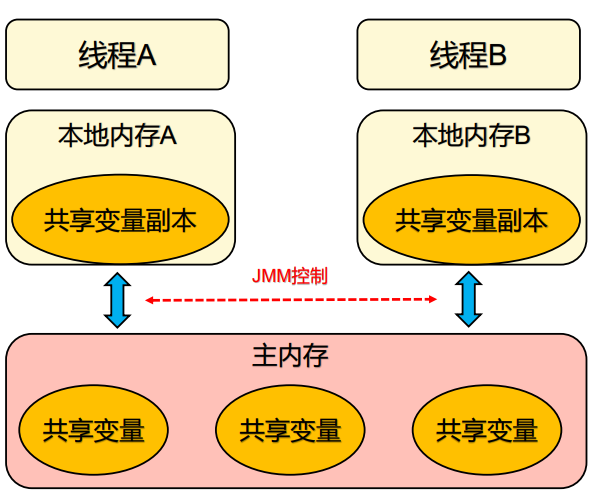
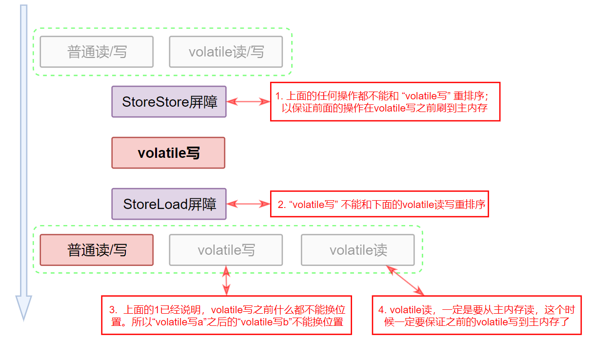

# 线程


## 基本概念

### 线程 & 进程

| 程序 | 是指令序列，这些指令可以让CPU做指定的任务。                  |
| ---- | ------------------------------------------------------------ |
| 进程 | 是程序的实体。是受操作系统管理的基本运行单元。是线程的容器。<br />◾  进程虽然是相互独立的，但它们可以相互通信，较为通用的方式是使用Socket或者HTTP协议。<br />◾  进程拥有共享的系统资源，比如：内存、网络端口，供其内部线程使用。<br />◾  进程较重，因为创建进程需要操作系统分配资源，会占用内存。 |
| 线程 | 是在进程中独立运行的子任务，是进程的一个子集，先有进程，后有线程。<br />◾  线程存在于进程中，是进程的一个子集，先有进程，后有线程。<br />◾  虽然线程很轻，但是线程上下文切换的时间成本很高。 |

### 上下文切换

即使是单核处理器也支持多线程执行代码，CPU通过给每个线程分配CPU时间片来实现这个机制。时间片是CPU分配给各个线程的时间，因为时间片非常短，所以CPU通过不停地切换线程执行，让我们感觉多个线程是同时执行的，时间片一般是几十毫秒（ms）。

CPU通过时间片分配算法来循环执行任务，当前任务执行一个时间片后会切换到下一个任务。但是，切换前会保存上一个任务的状态，以便下次切换回这个任务时，可以再加载这个任务的状态。所以任务从保存到再加载的过程就是一次**上下文切换**。

<span style='color:red'>**上下文切换会影响多线程的执行速度，那么我们应该如何减少上下文切换呢？**</span>

减少上下文切换的方法有：无锁并发编程，CAS算法，使用最少线程和使用协程。

- 无锁并发编程：多线程竞争锁的时候，会引起上下文切换，所以多线程处理数据时，可以用一些办法来避免使用锁。如将数据的ID按照hash算法取模分段，不同的线程处理不同段的数据。
- CAS算法：Java的Atomic包使用CAS算法来更新数据，不需要加锁。
- 使用最少线程：避免创建不需要的线程。
- 协程：在单线程里实现多任务的调度，并在单线程里维持多个任务间的切换。

### 并发 & 并行

并行：把每一个任务分配黑每一个处理器独立完成。在同一时间点，任务一定是同时运行。

并发：把任务在不同的时间点交给CPU去完成。在同一时间点，任务不会同时运行。


## 多线程

多线程会带来什么问题呢？

- **线程安全问题：**
  引起线程安全问题的根本原因是：多个线程间**共享变量**。
  “共享”：意味着多个线程可访问；“可变”：意味着值在其生命周期可以发生变化。
  在没有充足同步的情况下，多个线程中的操作执行顺序是不可预测的。

- **活跃性问题：**死锁，饥饿，活锁，糟糕的响应性
  死锁：多个线程相互持有彼此正在等待的锁，而又不释放已持有的锁。
  饥饿：线程由于无法访问到它所需要的资源而不能继续执行，就发生了“饥饿”。
  活锁：线程不断重复执行相同的操作，且总会失败。
  糟糕的响应性：CPU密集型的后台任务与事件线程共同竞争CPU时钟周期。

- **性能问题：**上下文切换，抑制编译器优化
  上下文切换：会带来极大的开销，CPU时间将更多的花费在线程调度而不是线程运行上。
  编译器优化：当线程共享数据时，必须使用同步机制，而这些机制往往会抑制某些编译器优化。

并发编程的三个特性：

- 原子性：一个操作的执行过程不能被打断。要么全部执行，要么都不执行。比如count++这个操作，看似是一行代码，但实际上包括“读取 - 修改 - 写入”三个操作。
- 有序性：编译器优化的时候可能导致指令重排。
- 可见性：当一个线程修改了共享变量的值时，其他线程能够立即得知这个修改。volatile，synchronized，final


### 死锁

多个线程相互持有彼此正在等待的锁，而又不释放已持有的锁。就会形成死锁。

> **在数据库系统的设计中考虑了检测死锁，以及从死锁中恢复**。在执行一个事务时可能需要获取多个锁，并一直持有这些锁直到事务提交。在两个事务之间很可能发生死锁。如果没有外部干涉，这两个事务将永远等待下去。*但数据库服务器不会让这种情况发生*，当它检测到一组事务发生了死锁时（通过在表示等待关系的有向图中搜索循环），将选择一个牺牲者并放弃这个事务。作为牺牲者的事务会释放它所持有的资源，从而使其他事务继续进行。

JVM在解决死锁问题方面并没有数据库服务器那样强大。当一组Java线程发生死锁时，这些线程将永远不能再用了。

### 如何排查死锁？


### JMM

> Java内存模型（JSR-133） [The Java Memory Model (umd.edu)](http://www.cs.umd.edu/users/pugh/java/memoryModel/)
>
> 《深入理解java虚拟机》《java并发编程的艺术》
>
> **Java内存模型为什么会出现呢？**
>
> 为了屏蔽各种硬件和操作系统的内存访问差异，以实现让Java程序在各种平台下都能达到一致的内存访问效果。（C和C++，直接使用物理硬件和操作系统的内存模型。由于不同平台上内存模型的差异，有可能导致程序在一套平台上**并发**完全正常，而在另一套平台上**并发**访问却经常出错，所以在某些场景下，必须针对不同的平台来编写程序）
>
> 定义Java内存模型要：① 足够严谨：让Java的并发内存访问操作不会产生歧异；② 足够宽松：使得虚拟机的实现能有足够自由的空间去利用硬件的各种特性（*寄存器，高速缓存，指令集中某些特有指令*）来获得更好的速度。
>
> **Java内存模型的主要目的是定义程序中各种变量的访问规则，即关注在虚拟机中把变量值存储到内存和从内存中取出变量值这样的底层细节。**（变量：实例字段，静态字段，构成数组对象的元素。不包括线程私有的局部变量与方法参数）。Java内存模型并没有限制执行引擎使用处理器的特定寄存器或缓存来和主内存进行交互，也没有限制即时编译器是否需要进行调整代码执行顺序这类优化措施。

- Java内存模型规定了所有的变量都存储在**主内存**（Main Memory，虚拟机内存的一部分）。
- 每条线程有自己的**工作内存**（Working Memory，可与处理器高速缓存类比）。
- 线程的工作内存中保存了被该线程使用的变量的主内存副本，线程对变量的所有操作（读写）都必须在工作内存中进行，不能直接读写主内存中的数据。
- 不同线程之间也无法直接访问对方工作内存中的变量，线程间变量值的传递均需要通过主内存。
- 主内存对应于Java堆中的对象实例数据部分；工作内存则对应于虚拟机栈中的部分区域。




在并发编程中，需要处理两个关键问题：

- 线程之间如何通信
- 线程之间如何同步

在命令式编程中，线程之间的通信机制有两种：共享内存和消息传递。

| **共享内存的并发模型（Java采用）** | 1.  线程之间共享程序的公共状态。通过 写-读 内存中的公共状态进行**隐式通信**。<br />2.  同步是显式进行的，我们必须显式指定某个方法或者某段代码需要在线程之间互斥执行。 |
| ---------------------------------- | ------------------------------------------------------------ |
| 消息传递的并发模型                 | 1.  线程之间必须通过发送消息来显式进行通信。<br />2.  由于消息的发送必须在消息的接收之前，因此同步时隐式进行的。 |
|                                    |                                                              |

Java线程之间的通信由Java内存模型（JMM）控制，JMM决定一个线程对共享变量的写入何时对另一个线程可见。


#### volatile

volatile变量自身具有以下特性：

| 可见性 | 对一个volatile变量的的读，总是能看到（任意线程）对这个volatile变量最后的写入。 |
| ------ | ------------------------------------------------------------ |
| 原子性 | 对任意单个volatile变量的读、写具有原子性，但类似于volatile++这种复合操作不具有原子性。 |

**1.  happens-before**

从JSR-133开始，volatile变量的 写 - 读 可以实现线程之间通信。volatile写 和 锁的释放有相同的内存语义；volatile读 和 锁的获取 有相同的内存语义。

```java
/*
线程A 写数据之后flag才为true
线程B flag为true之后才可读
volatile禁止重排序，所以一定是：写之后才可读。

1 happens-before 2
3 happens-before 4
2 happens-before 3 （volatile）
===> 1 happens-before 4
*/
class VolatileExample {
	int a = 0;
    volatile boolean flag = false;
    
    public void writer(){  // 线程A 写数据之后flag才为true
        a = 1;			// 1: 普通写a
        flag = true;	// 2: volatile写
    }
    
    public void reader() {  // 线程B flag为true之后才可读
        if (flag) {		// 3: volatile读
            int i = a;	// 4: 普通读a
            ...
        }
    }
}
```

**2.  写-读内存语义**

当写一个volatile变量时，JMM会把该线程对应的本地内存中的共享变量值刷新到主内存。

当读一个volatile变量时，JMM会把该线程对应的本地内存置为无效。线程接下来将从主内存中读取共享变量。

**3.  内存语义的实现**

重排序分为编译器重排序和处理器重排序。

① 编译器重排序规则表：

| 操作A      | 操作B      | 执行排序 |
| ---------- | ---------- | -------- |
| 普通读/写  | 普通读/写  | AB或者BA |
| 普通读/写  | volatile读 | AB或者BA |
| 普通读/写  | volatile写 | AB       |
| volatile读 | 普通读/写  | AB       |
| volatile读 | volatile读 | AB       |
| volatile读 | volatile写 | AB       |
| volatile写 | 普通读/写  | AB或者BA |
| volatile写 | volatile读 | AB       |
| volatile写 | volatile写 | AB       |


为了实现volatile的内存语义，编译器在生成字节码时，会在指令序列中插入内存屏障来禁止特定类型的处理器重排序。

> load（载入）：主内存 -> 工作内存；store（存储）：工作内存 -> 主内存。



volatile写之前的任何操作都不能和volatile写换位置。volatile写的时候，会把上面的的修改都刷到主内存的。一般我们认为volatile写之前的操作会对其他线程的操作产生影响。

volatile写之后的普通操作一般认为不会对其他线程的操作产生影响，所以在前在后无所谓。但是volatile写之后的volatile读写，不能换位置。首先volatile写1之后的volatile写2肯定时不能换位置的


普通读写的数据，不会对其他线程产生影响。

volatile一般用于一个线程写，其他很多线程读的场景。
